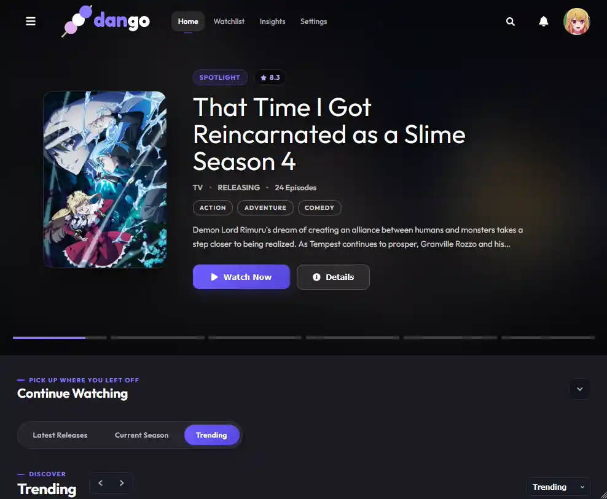

<div align="center">


_A local-first anime web app focused on performance, privacy, and personal library tracking._

[](https://opensource.org/licenses/MIT)

[](https://github.com/serifpersia/dango)


[](https://dango-users-badge.ramiserifpersia.workers.dev/?view=status)



</div>

---

**dango** is a lightweight, self-hosted Node.js application built for querying anime metadata, managing personal watchlists, and logging viewing progress through a fast local interface.

## Highlights

- **Hardware Efficient:** Engineered with a minimal footprint to run effortlessly on low-spec hardware, SBCs, and mobile environments.
- **Metadata & Discovery:** Browse trending titles, search catalog entries, and view release schedules locally.
- **Multi-Provider Playback:** Switch seamlessly between multiple third-party streaming providers directly within the player interface.
- **Watchlist Tracking:** Categorize titles (Watching, Completed, Plan to Watch) with fine-grained progress states.
- **Library Insights:** Built-in dashboard tracking viewing habits, personal stats, and completion ratios.
- **Trackers & Sync:** Bi-directional AniList sync and one-way MyAnimeList list imports.
- **Expanded Media Hub:** Dedicated interfaces for Manga, ASMR, Youtube Music, Internet Radio and TV/Movies.
- **LAN Security:** Optional LAN authentication with password enforcement for multi-device local network deployments.

---

## Installation

### Prerequisites

| Requirement | Supported Version      | Notes                                                     |
| :---------- | :--------------------- | :-------------------------------------------------------- |
| **Node.js** | `>= 22.12.0`           | Required runtime ([Download](https://nodejs.org/))        |
| **npm**     | Bundled with Node      | Global install (`npm install -g @serifpersia/dango`)      |
| **pnpm**    | `11` (`npm i -g pnpm`) | Only needed for source development (`run.bat` / `run.sh`) |

---

### Quick Install (CLI)

Install the global CLI binary via npm:

```bash
npm install -g @serifpersia/dango
```

Launch the interface from anywhere:

```bash
dango
```

> [!IMPORTANT]
> Once the server initializes, navigate to `http://localhost:3000` in your browser. The background process runs locally until terminated (`Ctrl + C or q key press as well as window X button closing action`).

---

### Release Zip (no install)

No `npm install` needed — dependencies ship inside the zip, client is prebuilt:

1. Download and extract `dango.zip` from [Releases](https://github.com/serifpersia/dango/releases).
2. Install Node.js 22.12+ (`node --version` to check).
3. Launch using `run.bat` (Windows) or `./run.sh` (Linux/macOS), then open `http://localhost:3000`.

---

### Android Installation

<details>
<summary><b>Option 1: Termux Environment</b></summary>

<br>

Run standard dango via Termux:

1. Install **[Termux](https://termux.dev/)** (obtain via [F-Droid](https://f-droid.org/en/packages/com.termux/)).
2. Update base dependencies:
   ```bash
   pkg update
   ```
   ```bash
   pkg upgrade -y
   ```
3. Install Node.js:
   ```bash
   pkg install nodejs -y
   ```
4. Install and run dango:
   ```bash
   npm install -g @serifpersia/dango
   dango
   ```
5. Open your mobile browser at `http://localhost:3000`.

</details>

<details>
<summary><b>Option 2: Standalone APK</b></summary>

<br>

A standalone bundle packaging Node.js, dango, and a local WebView container.

1. Grab the latest `.apk` from [Releases](https://github.com/serifpersia/dango/releases).
2. Install the APK (allow _Install from Unknown Sources_ when prompted).
3. Open the app. Core runtimes auto-provision on first launch.

**Compiling from Source:**

```bash
cd android-app
python fetch-termux-node.py

# Windows
build-debug.bat

# Linux / macOS
chmod +x build-debug.sh && ./build-debug.sh
```

_Build requirements: Python 3, JDK 17+, Android SDK (Platform 36, Build-Tools 36.0.0)._

</details>

---

## Manual Setup (Development)

The project is structured as a **pnpm workspace** (`client` and `server`) managed by a unified lockfile. You need Node.js 22.12+ and pnpm 11 (`npm install -g pnpm`).

```bash
# Clone the repository
git clone https://github.com/serifpersia/dango.git
cd dango

# Install dependencies (root + workspaces)
pnpm install

# Compile workspaces (Vite frontend + tsc backend)
pnpm run build
```

Run via interactive environment scripts:

```bash
# Linux / macOS
chmod +x run.sh && ./run.sh

# Windows
run.bat
```

### Command Reference

| Command                              | Action                                     |
| :----------------------------------- | :----------------------------------------- |
| `dango`                              | Start the installed client daemon          |
| `dango --version`                    | Display current installed version          |
| `pnpm run dev`                       | Start full dev stack via `orchestrator.js` |
| `pnpm --filter dango-client run dev` | Run Vite frontend independently            |
| `pnpm --filter dango-server run dev` | Run backend via `tsx watch`                |
| `pnpm -r run lint`                   | Run ESLint passes across all packages      |

---

## Storage & Persistence

dango stores SQLite databases, cached indices, and credentials in the OS application data registry rather than the global `node_modules` path:

| Platform    | Default Path                                     |
| :---------- | :----------------------------------------------- |
| **Windows** | `%APPDATA%\dango`                                |
| **macOS**   | `~/Library/Application Support/dango`            |
| **Linux**   | `$XDG_DATA_HOME/dango` or `~/.local/share/dango` |

> [!IMPORTANT]
> Legacy installs will automatically migrate `.env` variables and SQLite records from older `server/` structures into the proper user directory on launch.

---

## Data Synchronization

dango is **local-first**: primary application state lives in your local SQLite store. Cloud syncing creates point-in-time JSON snapshots to maintain seamless backups across multiple installations.

```
Sync Priority Engine:
[1] GitHub Sync ──(fallback)──> [2] Google Drive ──(fallback)──> [3] Rclone
```

### 1. GitHub Sync

1. Open **Settings → Synchronization**.
2. Click **Sign in with GitHub**.
3. Authorize via the OAuth device code flow.

dango creates a private repository named `dango-sync-data` to read/write JSON snapshots (`sync.json` for production, `sync.dev.json` for development).

### 2. Google Drive

1. Open **Settings → Synchronization**.
2. Click **Sign in with Google** and authorize permissions.

Data writes directly to a sandbox `appDataFolder` on your personal Drive. To clear backups, revoke app permissions under Google Drive's _Manage Apps_ menu.

> [!IMPORTANT]
> Advanced users can supply their own custom Github and Google OAuth Client ID & Secret in settings.

### 3. Rclone (Third-Party Remotes)

Used as a manual fallback for services like Mega, Dropbox, or custom WebDAV:

1. Ensure `rclone` is installed and mapped to your system `PATH`.
2. Configure your desired target via `rclone config`.
3. Pick your configured remote profile inside **Settings → Synchronization**.

---

## Tracker Integrations

### AniList

Bidirectional sync is fully supported:

- Go to **Trackers** in the navigation panel.
- Select **Sync Now**.
- Local episode progress updates remotely; external catalog updates merge safely into your local database without overwriting uncommitted states.

---

## Community

Need help configuring your setup, troubleshooting builds, discussing feature requests or simply just chat about anime?

<div align="left">

[](https://discord.gg/2FTSPXCsvn)

</div>

---

## Disclaimer & Legal

dango is an open-source, local-first web app. It does not host or distribute unauthorized media or copyrighted video assets. Users are solely responsible for ensuring their usage aligns with relevant local laws and digital copyright regulations.

## License

Distributed under the terms of the [MIT License](LICENSE).
